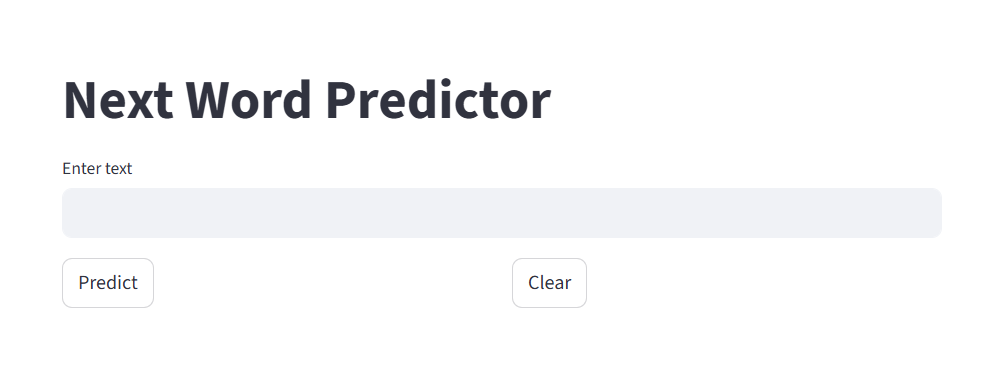
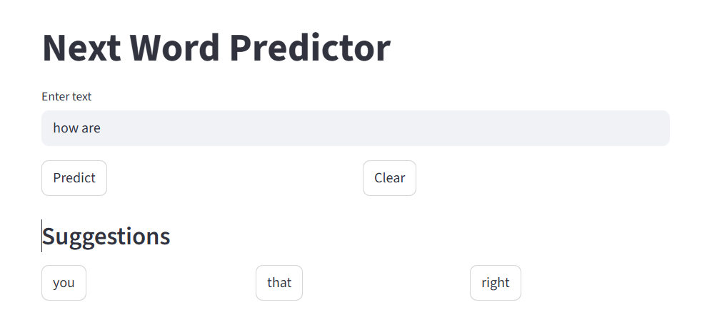
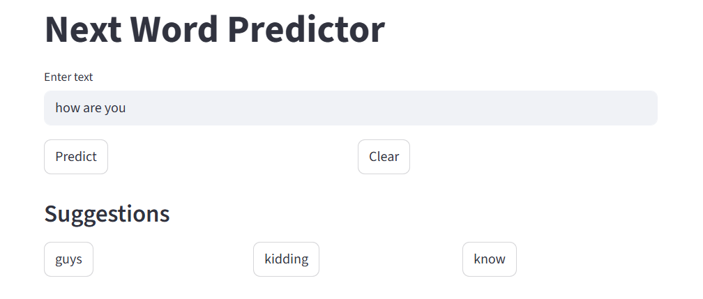

# Next Word Predictor using LSTM

## Project Overview

This project is a **Next Word Prediction Web Application** built using **Python, TensorFlow (Keras), and Streamlit**.

The system predicts the **next possible words** based on the text entered by the user.  

It uses a **Long Short-Term Memory (LSTM) neural network**, which is commonly used for **Natural Language Processing (NLP)** tasks.

After entering a sentence, the model suggests **three possible next words**.  
Users can use these suggestions as guidance and **manually type the next word** to continue predicting the sentence.

# Features

* Predicts **top 3 possible next words**
* Built using **LSTM neural network**
* **Interactive Streamlit interface**
* Helps users **predict the next word in a sentence**
* **Clear button** to reset the input text
* Uses a **custom dataset for training**

# Project Screenshots

### Interface Screenshot 1



### Interface Screenshot 2



### Interface Screenshot 3



# Project Structure

```
new_next_word_predictor
│
├── app.py                          # Streamlit web application
├── predict.py                      # Predict next words using trained model
├── train_model.py                  # Train the LSTM model
├── tokenizer.pkl                   # Saved tokenizer
├── lstm_model.h5                   # Trained LSTM model
├── next_word_predictor.txt         # Dataset used for training
├── requirements.txt                # Required libraries
├── README.md                       # Project documentation
│
├── next_word_predictor1.png        # Interface screenshot 1
├── next_word_predictor2.png        # Interface screenshot 2
└── next_word_predictor3.png        # Interface screenshot 3
```

# Technologies Used

* Python
* TensorFlow / Keras
* LSTM (Long Short-Term Memory)
* NumPy
* Streamlit

# Installation

Clone the repository

```bash
git clone https://github.com/ManpreetKaur96/next_word_predictor.git
```

Go to the project folder

```bash
cd next_word_predictor
```

Install required libraries

```bash
pip install -r requirements.txt
```

# Train the Model

To train the model again using the dataset:

```bash
python train_model.py
```

This will generate:

* `lstm_model.h5`
* `tokenizer.pkl`

# Run the Application

Start the Streamlit web app:

```bash
streamlit run app.py
```

After running the command, open the **local Streamlit URL** in your browser.

# How the System Works

1. The user enters a sentence in the input box.
2. The model processes the text using the **trained tokenizer**.
3. The LSTM model predicts the **top three most probable next words**.
4. The predicted words are displayed as **suggestions**.
5. The user can **manually type the next word** and click the **Predict button again** to get new suggestions.

# Future Improvements

* Use a **larger dataset** to improve prediction accuracy
* Add **grammar correction and sentence completion**
* Improve the **user interface design**
* Deploy the application using **Streamlit Cloud or Hugging Face Spaces**
* Add support for **multiple languages**

# Author

Manpreet Kaur

# Role

Machine Learning & Web Development Learner
Interested in **Data Science, Machine Learning, and Data Analysis**

